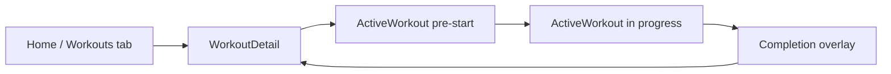
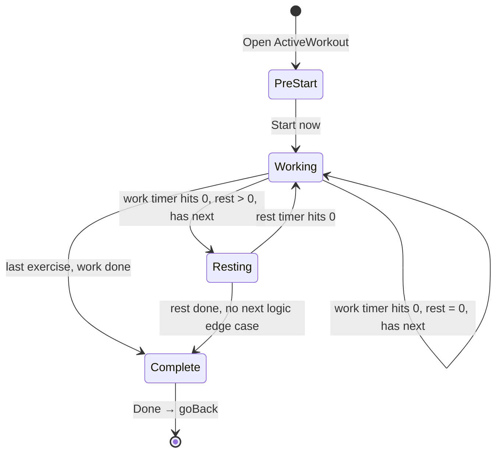

# Programs Flow — Implementation Guide

How users **discover**, **preview**, and **run** workout programs in this app — including the database model, exercise loading, and active workout logic. Use this to implement the same flow on web.

**Primary source files:**

| Area | Path |
|------|------|
| Program list | `src/screens/WorkoutsScreen.tsx` |
| Home spotlight | `src/screens/HomeScreen.tsx` |
| Program detail | `src/screens/WorkoutDetailScreen.tsx` |
| Active workout player | `src/screens/ActiveWorkoutScreen.tsx` |
| Exercise loading + timing helpers | `src/lib/programExercises.ts` |
| Exercise video URLs | `src/lib/exerciseVideoUrl.ts` |
| Background music | `src/lib/programWorkoutMusic.ts` |
| Completion UI | `src/components/WorkoutCompletionOverlay.tsx` |
| AI-created programs | `docs/ai-program-creation.md` |

---

## High-level user journey



1. User browses programs on **Home** (spotlight card) or **Workouts** (featured + full list).
2. Tap a program → **Workout detail** (cover, stats, exercise list, description).
3. Tap **Start now** → **Active workout** pre-start screen (video preload, mode picker).
4. Tap **Start now** again → timed or sets-based session with exercise videos.
5. Finish last exercise → **completion overlay** → back to previous screen.

There is **no server-side “workout completed” log** today. Completion is in-app state only; nothing is written to Supabase when a user finishes a session.

---

## Data model

Programs are structured in layers. The mobile app **flattens** all exercises into one ordered list for playback.

```
programs
  ├── id, title, slug, description, status
  ├── cover_image_url, song_url (optional background track)
  ├── minutes_per_session, sessions_per_week, duration_weeks
  ├── user_id (NULL = global catalog; UUID = user-owned e.g. AI-created)
  └── difficulty_levels (FK)

program_location_tracks
  ├── program_id
  ├── location_id  (gym / home / club)
  └── sort_order

program_sessions
  ├── track_id
  ├── name           (e.g. "Day 1")
  ├── duration_minutes
  └── sort_order

program_exercises          ← per-session prescription
  ├── session_id
  ├── exercise_id
  ├── sort_order
  ├── duration_minutes     (time-based work)
  ├── sets, reps           (sets-based work)
  └── rest_after_seconds   (rest after this exercise in time mode)

exercises                   ← shared exercise catalog
  ├── id, title
  ├── image_url, video_url
  └── location_id
```

### What the app actually loads

`fetchProgramExercises(programId)` queries:

```sql
-- Conceptual shape (Supabase nested select)
program_location_tracks
  WHERE program_id = :programId
  → program_sessions
    → program_exercises
      → exercises (id, title, image_url, video_url)
```

All tracks and sessions for that program are merged into **one array**, sorted by `program_exercises.sort_order`.

> **Web note:** The schema supports multi-location and multi-day plans, but the current player does **not** let the user pick a location track or day. Everything is one linear workout. AI-created programs use one track (Home), one session (“Day 1”), and N exercises.

---

## Program visibility (who sees what)

Same rule on Home, Workouts, and AI catalog:

| User | Programs shown |
|------|----------------|
| Logged in | `status = 'published' AND user_id IS NULL` **OR** `user_id = currentUserId` |
| Not logged in | `status = 'published' AND user_id IS NULL` only |

Ordered by `created_at DESC`.

**Featured carousel** (Workouts): first 3 **global** programs (`user_id IS NULL`), not user-created ones.

**Home spotlight**: most recently created visible program (`limit 1`).

---

## Screen 1 — Browse programs

### Workouts tab (`WorkoutsScreen`)

Loads:

- Programs (query above)
- `categories` (`id, name, slug`, ordered by `sort_order`) for “Focus Area” grid

**UI sections:**

- Focus Area — category chips (display only; **no filter wired yet**)
- Featured — horizontal cards → `WorkoutDetail`
- Programs — vertical list → `WorkoutDetail`

**Display helpers:**

- Duration: `minutes_per_session` → `"15 Mins"`, else `duration_weeks` → `"4 wk"`
- Calories (estimate): `minutes_per_session * 4` → `"Est. 60 Kcal"`

### Home tab (`HomeScreen`)

- Greeting + user display name from profile
- Main card = latest visible program → `WorkoutDetail`

---

## Screen 2 — Program detail (`WorkoutDetail`)

**Route param:** `{ programId: string }`

**Parallel fetch:**

```typescript
const [programRes, exerciseList] = await Promise.all([
  supabase.from('programs').select(`
    id, title, description, cover_image_url,
    minutes_per_session, user_id,
    difficulty_levels ( name )
  `).eq('id', programId).maybeSingle(),
  fetchProgramExercises(programId),
]);
```

**UI:**

- Hero: cover image, title, minutes, estimated calories
- Tabs: **Exercises** | **Details**
- Exercises tab: list with thumbnail (`exercises.image_url`) + title
- Details tab: `programs.description`
- Fixed bottom: **Start now** → `ActiveWorkout` with same `programId`

**Owner actions:**

- If `program.user_id === currentUserId`, show **Delete** (deletes `programs` row; cascades depend on DB FKs)

---

## Screen 3 — Active workout (`ActiveWorkoutScreen`)

**Route param:** `{ programId: string }`

### Load on mount

1. **`fetchProgramExercises(programId)`** → ordered `ProgramExerciseItem[]`
2. **`programs`** row: `cover_image_url`, `title`, `song_url`
3. If `song_url` present → load looping background music (`createProgramWorkoutMusic`)

### `ProgramExerciseItem` shape

```typescript
type ProgramExerciseItem = {
  id: string;              // program_exercises.id
  exerciseId: string;      // exercises.id
  title: string;
  image_url: string | null;
  video_url: string | null;
  durationMinutes: number | null;
  sets: number | null;
  reps: number | null;
  restAfterSeconds: number | null;
};
```

### Timing helpers (`programExercises.ts`)

```typescript
function workDurationSeconds(ex): number {
  // duration_minutes → seconds; default 60 if missing
}

function restDurationSeconds(ex): number {
  // rest_after_seconds; default 0
}
```

---

## Pre-start phase (before workout runs)

State: `workoutStarted === false`

1. Show program **cover** as background.
2. **Hidden/preload** first exercise video (must buffer before Start is enabled).
3. User picks **workout mode** (can change only before start):
   - **Time** — auto timer per exercise + optional rest
   - **Sets / reps** — manual “Next” when done
4. When video is ready (`firstFrameReady` + `videoPrimeReady`), show card:
   - “Up first” + exercise title + meta (duration or sets/reps)
   - **Start now** → sets `workoutStarted = true`

**Readiness signals:**

- `player.status === 'readyToPlay'`
- Buffered position / playhead thresholds
- Fallback timeouts (so slow networks are not blocked forever)

---

## Workout modes

### Time mode (default)

State machine per exercise index:

```
work (countdown duration_minutes)
  → if rest_after_seconds > 0 AND more exercises → rest (countdown)
  → else → next exercise work OR finish
```

**Timer:**

- 1-second interval decrements `secondsLeft`
- When `secondsLeft === 0`:
  - End of **work** + rest configured → beep, switch to `phase: 'rest'`, start rest timer
  - End of **work** + no rest → advance to next exercise
  - End of **rest** → beep, advance to next exercise
- Last exercise complete → `workoutFinished = true`

**During rest (time mode):**

- Video switches to **preview next exercise** (`nextExercise.video_url`)
- Overlay: “Get ready for {next title}”
- Music volume lowered (~7%)

**Controls:** pause/play, previous/next exercise, skip forward

### Sets / reps mode

- No countdown timer (`secondsLeft = null`)
- Shows `formatSetsRepsLabel(ex)` e.g. `"3 sets · 12 reps"`
- User taps **Next** when finished with current exercise
- Hint: “Go at your pace · tap Next when done”
- Video plays while `isRunning`; pause when user pauses

**Exercise prescription priority:**

| Field | Time mode | Sets mode |
|-------|-----------|-----------|
| `duration_minutes` | Work timer length | Shown as meta if present |
| `sets`, `reps` | Ignored for timer | Primary display |
| `rest_after_seconds` | Rest between exercises | Not auto-timed |

AI-generated programs may set **either** duration **or** sets/reps per exercise (or both).

---

## Exercise video playback

**Source selection:**

```typescript
const url = currentExercise?.video_url?.trim();
const source = url
  ? resolveExerciseVideoSource(url)  // handles Google Drive links
  : LOCAL_FALLBACK_VIDEO;            // bundled asset if missing
```

**During time-mode rest:** video source = **next** exercise’s URL.

**Player:** `expo-video` (`useVideoPlayer`), looped, muted (beeps/music separate).

**Google Drive:** share URLs rewritten to direct download/stream URLs — see `src/lib/exerciseVideoUrl.ts`.

---

## Progress UI during workout

- **Progress bar:** one segment per exercise; active segment = `currentIndex`
- **Header:** back, music mute (if `song_url`), landscape toggle
- **Main area:** full-width `VideoView` + gradient overlays
- **Bottom controls** (after start): prev | play/pause | next (or “Next” pill in sets mode)

**Landscape:** locks orientation; simplified layout with timer/sets label.

---

## Background music

If `programs.song_url` is set:

- Looping audio via `expo-av`
- Volume rules (`programWorkoutMusic.ts`):
  - Normal during work
  - ~7% during time-mode rest
  - Ducked during transition beeps
  - Paused when user pauses timer
- Mute toggle in header

---

## Sound cues

- **Double beep** on rest start and when leaving rest (`playDoubleBeep`)
- Ducks music briefly during beeps

---

## Completion

When `workoutFinished === true`:

- `WorkoutCompletionOverlay` — confetti, program title, **Done** button
- **Done** → `navigation.goBack()` (typically to Workout detail)

No API call; no progress persisted.

---

## Navigation map (mobile)

```
Tabs
  Home ──────────────► WorkoutDetail ──► ActiveWorkout
  Workouts ──────────► WorkoutDetail ──► ActiveWorkout
  Custom (AI) ───────► WorkoutDetail ──► ActiveWorkout  (after generating)
  Profile
```

Stack screens hide the bottom tab bar.

**Route types** (`src/navigation/types.ts`):

```typescript
WorkoutDetail: { programId: string };
ActiveWorkout: { programId: string };
```

---

## Supabase queries (copy-paste reference)

### List programs

```typescript
let query = supabase
  .from('programs')
  .select(`
    id, title, cover_image_url, minutes_per_session,
    duration_weeks, user_id,
    difficulty_levels ( name )
  `)
  .order('created_at', { ascending: false });

if (currentUserId) {
  query = query.or(
    `and(status.eq.published,user_id.is.null),user_id.eq.${currentUserId}`,
  );
} else {
  query = query.eq('status', 'published').is('user_id', null);
}
```

### Program detail + exercises

```typescript
// Program metadata
supabase.from('programs').select(`...`).eq('id', programId).maybeSingle();

// Flat exercise list
fetchProgramExercises(programId);
// implementation: program_location_tracks → sessions → program_exercises → exercises
```

### Active workout extras

```typescript
supabase
  .from('programs')
  .select('cover_image_url, title, song_url')
  .eq('id', programId)
  .maybeSingle();
```

---

## Web implementation checklist

### Pages / routes

| Route | Purpose |
|-------|---------|
| `/workouts` | Program list (featured + all) |
| `/workouts/:programId` | Detail + exercise list + Start |
| `/workouts/:programId/play` | Active player (or modal/full-screen) |

### Core modules to port

1. `fetchProgramExercises` + `workDurationSeconds` + `restDurationSeconds`
2. `resolveExerciseVideoSource` (Drive + direct URLs)
3. Time-mode state machine (work/rest/advance/finish)
4. Sets-mode manual advance
5. Pre-start video preload gate

### Video on web

Replace `expo-video` with `<video>` or a web player library. Keep the same source resolution logic from `exerciseVideoUrl.ts`.

### Audio on web

Replace `expo-av` with HTML `<audio loop>` for `song_url`; mirror volume ducking rules if desired.

### Optional enhancements (not in mobile yet)

- Filter programs by `categories`
- Pick location track based on `profiles.training_environment`
- Persist workout completion / history table
- Multi-day session picker (`program_sessions.name`)

---

## Creating programs (admin / AI)

Programs enter the same pipeline whether curated or AI-generated:

1. Insert `programs`
2. Insert `program_location_tracks`
3. Insert `program_sessions`
4. For each exercise: link or create `exercises`, insert `program_exercises` with sort order and prescription fields

See **[AI Program Creation](./ai-program-creation.md)** for the automated path.

**Example AI program structure:**

```
programs (user_id = creator, status = published)
  └── program_location_tracks (Home location UUID)
        └── program_sessions ("Day 1")
              └── program_exercises × N
                    └── exercises (shared or newly created)
```

---

## Edge cases & gotchas

1. **Empty program** — Active workout shows “No exercises in this program” and blocks start.
2. **Missing video** — Falls back to bundled squat video; workout still runs.
3. **Missing duration** — Time mode defaults to **60 seconds** work per exercise.
4. **Zero rest** — Skips rest phase; goes straight to next exercise.
5. **Last exercise** — No rest after final item; workout completes.
6. **Mode locked after start** — Time / Sets switch disabled once `workoutStarted`.
7. **User programs** — Appear in list alongside global programs; only owner sees Delete on detail.
8. **Calories** — UI estimate only (`minutes * 4`); not stored in DB.
9. **Categories** — Loaded for display; tapping does not filter programs yet.
10. **No enrollment** — Users do not “join” a program; they open and play it directly.

---

## State diagram (time mode)



---

## Related docs

- [Signup & Onboarding](./signup-onboarding.md) — profile fields used for personalization elsewhere
- [AI Program Creation](./ai-program-creation.md) — how custom programs are created and saved
